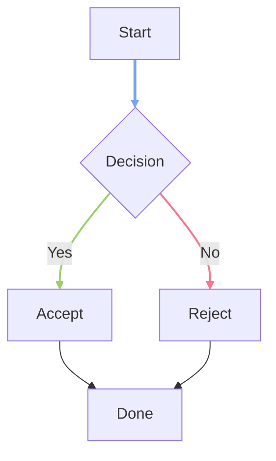
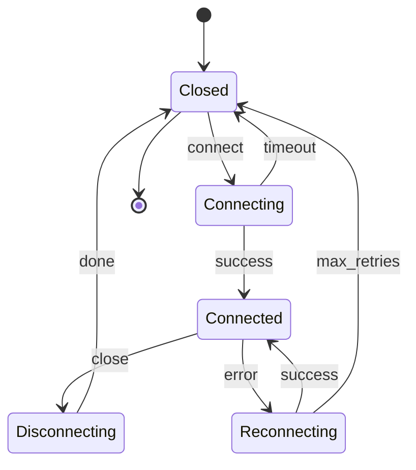

TODO

```mermaid
graph TD
  A[Start] --> B{Decision}
  B -->|Yes| C[Accept]
  B -->|No| D[Reject]
  C --> E[Done]
  D --> E
  linkStyle 0 stroke:#7aa2f7,stroke-width:3px
  linkStyle 1 stroke:#9ece6a,stroke-width:2px
  linkStyle 2 stroke:#f7768e,stroke-width:2px
```

```mermaid
stateDiagram-v2
  [*] --> Closed
  Closed --> Connecting : connect
  Connecting --> Connected : success
  Connecting --> Closed : timeout
  Connected --> Disconnecting : close
  Connected --> Reconnecting : error
  Reconnecting --> Connected : success
  Reconnecting --> Closed : max_retries
  Disconnecting --> Closed : done
  Closed --> [*]
```

## What is Next?

<Cards>
  <Card title="Learn more about Next.js" href="https://nextjs.org/docs" />
  <Card title="Learn more about Fumadocs" href="https://fumadocs.dev" />
</Cards>
