# BOE XML Parser

A sophisticated XML parser for **Boletín Oficial del Estado** (BOE) documents that transforms hierarchical legal text into a navigable AST with dual-path addressing.

## Overview

The parser converts BOE XML documents into a rich semantic structure supporting both structural paths (`/c/1/a/2/p/3`) and legal citation paths (`/article/1/p/2`). This dual-path system enables precise navigation and retrieval of legal fragments.

```mermaid
flowchart TB
    subgraph Input["📄 Input"]
        XML["BOE XML Document"]
    end

    subgraph Parse["🔍 Parse Phase"]
        Validate["XML Validation"]
        Linearize["Block Linearization"]
        Classify["Block Classification"]
    end

    subgraph Build["🏗️ Build Phase"]
        Traverse["State Machine Traversal"]
        Seed["Fragment Seed Generation"]
        Finalize["AST Finalization"]
    end

    subgraph Output["📦 Output"]
        Ast["BoeAstDocument"]
        Fragments["BoeFragment[]"]
        Indexes["Path Indexes"]
    end

    XML --> Validate
    Validate --> Linearize
    Linearize --> Classify
    Classify --> Traverse
    Traverse --> Seed
    Seed --> Finalize
    Finalize --> Ast
    Finalize --> Fragments
    Finalize --> Indexes
```



## Architecture

### Core Data Flow


### Dual Path System

The parser maintains two complementary addressing schemes:


**Structural Path** (`NodePathString`):

- Format: `/c/{chapter}/a/{article}/p/{paragraph}`
- Used for: Document traversal, parent-child relationships
- Segments: chapter, article, paragraph, subparagraph, annex, section, table, header

**Legal Path** (`LegalNodePathString`):

- Format: `/article/{number}/p/{paragraph}/sp/{subparagraph}`
- Used for: Legal citations, cross-references
- Segments: scope, article, paragraph, custom

**Ltree Path** (`LtreePathString`):

- Format: `n_c_1.n_a_2.n_p_3` (PostgreSQL ltree compatible)
- Used for: Database storage, hierarchical queries
- Supports: Ancestor/descendant queries via `@>`, `<@` operators

## Module Reference

### Entry Points

| Module       | Purpose               | Key Exports                                |
| ------------ | --------------------- | ------------------------------------------ |
| `service.ts` | Main parser service   | `BoeXmlParser` (Effect.Service)            |
| `api.ts`     | Interface definitions | `BoeXmlParserApi`, `BoeFragmentBuilderApi` |
| `index.ts`   | Public API            | Re-exports all public modules              |

### Type System (`types.ts`)


### Parsing Pipeline

#### 1. XML Parsing (`service.ts`)

```typescript
// Ordered XML parsing preserves document sequence
const orderedParser = new XMLParser({
  ignoreAttributes: false,
  attributeNamePrefix: "@_",
  textNodeName: "#text",
  preserveOrder: true, // Critical for legal documents
});
```

> **⚠️ Rough Edge:** The `orderedEntriesToRecord` function in `service.ts` (lines 522-562) contains complex logic for flattening ordered XML into records. This is fragile and may break with deeply nested structures.

#### 2. Block Linearization (`linearize.ts`)

Converts XML `<texto>` section into ordered blocks:


#### 3. Block Classification (`traversal/classify.ts`)

Maps CSS class names to semantic block types:

| CSS Class   | Handler                       | Output Type                             |
| ----------- | ----------------------------- | --------------------------------------- |
| `articulo`  | `articleRule`                 | `{ _tag: "article", number, title }`    |
| `capitulo`  | `chapterRule`                 | `{ _tag: "chapter", title, isSpecial }` |
| `seccion`   | section handler               | `{ _tag: "sectionHeading", title }`     |
| `parrafo`   | `paragraphOrSubparagraphRule` | paragraph or subparagraph               |
| `parrafo_2` | `paragraphOrSubparagraphRule` | Detects subparagraph markers            |
| `anexo_num` | annex handler                 | `{ _tag: "annexNumber", number }`       |
| `firma_*`   | `signatureRule`               | `{ _tag: "signature", role }`           |

> **⚠️ Rough Edge:** The `CLASSIFIER_RULES` registry (lines 103-120) is hardcoded. New BOE document types may require manual updates.

#### 4. State Machine Traversal (`traversal/engine.ts`)

The core of the parser is a functional state machine that processes classified blocks:


**State Structure:**

```typescript
interface MainState {
  mode: "main";
  chapterIndex: number;
  currentChapter?: number;
  currentArticle?: number;
  articleByChapter: Record<string, number>;
  paragraphByArticle: Record<string, number>;
  // ... more counters
}

interface AnnexState {
  mode: "annex";
  annexIndex: number;
  currentAnnex: number;
  annexParagraphByIndex: Record<string, number>;
  // ... annex-specific counters
}
```

> **⚠️ Rough Edge:** The state machine uses multiple `Record<string, number>` counters for tracking indices. This is error-prone and could be replaced with a more structured approach.

#### 5. Path Allocation (`traversal/path-allocator.ts`)

Converts state into hierarchical paths:

```typescript
export const Path = {
  chapter: (index: number): NodePathSegment => ({ _tag: "chapter", index }),
  article: (index: number): NodePathSegment => ({ _tag: "article", index }),
  paragraph: (index: number): NodePathSegment => ({ _tag: "paragraph", index }),
  subparagraph: (index: number): NodePathSegment => ({ _tag: "subparagraph", index }),
  // ...
};

// Renders to: /c/1/a/2/p/3
export const renderPath = (path: NodePath) => NodePathString(`/${path.map(...).join("/")}`);
```

#### 6. AST Finalization (`traversal/finalize.ts`)

Builds final structures with relationships:


**Context Windows:** Each fragment includes 180-character context snippets from adjacent fragments for retrieval augmentation.

### Path Query System (`path-query.ts`)

Provides type-safe path construction:

```typescript
// Legal path template literal
const path = legalPath`/article/${articleNum}/p/${paragraphNum}`;

// Fragment path
const scope = fragmentPath`/c/`; // All chapters

// Dual-mode path
const p = path`/article/1`; // Returns LegalNodePathString
const f = path`/c/`; // Returns FragmentPathQuery
```

### Legal Scope Resolution (`legal-scope.ts`)

Handles special document sections:


### Ltree Path Conversion (`ltree-path.ts`)

Converts paths to PostgreSQL ltree format:

```typescript
// Structural path to ltree
nodePathToLtree("/c/1/a/2/p/3"); // → "n_c_1.n_a_2.n_p_3"

// Legal path to ltree
legalNodePathToLtree("/article/2/p/3"); // → "ls_disposicion_final.la_32.n_p_3"
```

> **⚠️ Rough Edge:** The hex encoding for article numbers in legal paths (line 170: `toHex(segment.value)`) can produce very long labels for large article numbers, potentially hitting ltree label length limits.

## Query System (`query.ts`)

High-level query interface for fragment retrieval:

```typescript
// Query builders
Query.all(); // All fragments
Query.byLegalPath("/article/1"); // By legal path
Query.article("1", { paragraph: 2 }); // Article + paragraph
Query.dispositionArticle("disposicion-final", "primera"); // Disposition article

// Evaluation
const result = evaluateQuery(fragments, query);
// Returns: { _tag: "Match" | "Ambiguous" | "NotFound", ... }
```

## Formatting (`format.ts`)

Markdown output generation:

```typescript
const markdown = formatFragmentsAsMarkdown(
  fragments,
  "/c/", // Fragment path query
  metadata, // Optional metadata override
);
```

Generates structured Markdown with:

- Hierarchical headings based on node types
- HTML comments with path metadata
- Proper nesting of document sections

## Error Handling

All errors are typed Effect errors:

```typescript
type BoeParseError =
  | MissingRootDocumentoError // No <documento> root
  | InvalidMetadataError // Schema validation failed
  | MalformedTextSectionError // Missing <texto> section
  | NodePathCollisionError // Duplicate paths generated
  | EmptyFragmentContentError // Zero-length fragment
  | XmlParseError; // Generic XML error
```

## Testing

Test files are located in `test/collectors/boe/parser/`:

| Test File                   | Coverage                 |
| --------------------------- | ------------------------ |
| `core.test.ts`              | Main parser flows        |
| `ast-contract.test.ts`      | AST structure validation |
| `traversal.test.ts`         | State machine behavior   |
| `ltree.test.ts`             | Path conversions         |
| `format-query.test.ts`      | Query and formatting     |
| `invariants-direct.test.ts` | Invariant checking       |
| `coverage.test.ts`          | Edge cases               |

## Usage Examples

### Basic Parsing

```typescript
import { BoeXmlParser } from "./parser";

const program = Effect.gen(function* () {
  const parser = yield* BoeXmlParser;

  const document = yield* parser.parse({ xml: boeXmlString });

  console.log(`Title: ${document.metadata.title}`);
  console.log(`Fragments: ${document.fragments.length}`);

  return document;
});

const result = await Effect.runPromise(program.pipe(Effect.provide(BoeXmlParser.Default)));
```

### Path-Based Selection

```typescript
// Select by structural path
const chapter1 =
  yield *
  parser.selectByPath({
    document,
    query: "/c/",
  });

// Select by legal citation path
const article1 =
  yield *
  parser.selectByLegalPath({
    document,
    legalPath: "/article/1",
  });
```

### Query Interface

```typescript
import { Query, evaluateQuery } from "./parser/query";

const result = evaluateQuery(fragments, Query.article("5", { paragraph: 2 }));

if (result._tag === "Match") {
  result.fragments.forEach((f) => console.log(f.content));
}
```

### Fluent Builder

```typescript
const builder = yield * parser.fragmentBuilder({ metadata, strategy });

const fragments =
  yield *
  builder
    .chapter("Título I")
    .article({ number: "1", title: "Objeto" })
    .paragraph("Este es el contenido...")
    .subparagraph({ marker: "a", content: "Primera parte" })
    .build();
```

## Known Limitations & Rough Edges

1. **XML Flattening Complexity** (`service.ts:522-562`)
   - The `orderedEntriesToRecord` function is complex and fragile
   - May fail on deeply nested XML structures
   - Consider using a more robust XML-to-JSON transformation

2. **Hardcoded Classifier Rules** (`traversal/classify.ts:103-120`)
   - CSS class mappings are static
   - New BOE document layouts require code changes
   - Consider external configuration

3. **State Machine Counters** (`traversal/engine.ts`)
   - Multiple `Record<string, number>` counters are error-prone
   - Keys use string concatenation (`${chapter}:${article}`)
   - Could benefit from structured counter types

4. **Ltree Label Length** (`ltree-path.ts:170`)
   - Article numbers are hex-encoded
   - Long article identifiers may exceed ltree label limits
   - Consider hashing for very long identifiers

5. **Subparagraph Detection** (`traversal/classify.ts:69-83`)
   - Relies on regex patterns for marker detection
   - May miss non-standard subparagraph formats
   - Spanish-specific ordinal detection (ª/º)

6. **Memory Optimization Comment** (`service.ts:142-147`)
   - The `parseForIndexingWithReferences` returns minimal data for GC
   - This is a workaround for large XML documents
   - Consider streaming parsing for very large documents

7. **Incomplete Tokenizer Integration** (`service.ts:196-237`)
   - `countTokensByPath` requires EmbeddingService
   - Falls back to basic text selection on AST index miss
   - Could be more tightly integrated

## Integration with Indexing

The parser is typically used within the indexing workflow:


## Future Improvements

1. **Streaming Parser**: For very large documents, implement SAX-style streaming
2. **Configurable Classifiers**: External CSS class mappings via JSON config
3. **Schema Validation**: JSON Schema for BOE XML validation
4. **Parallel Fragment Processing**: Build AST nodes in parallel where possible
5. **Incremental Parsing**: Support for partial document updates
6. **Better Error Recovery**: Continue parsing on non-critical errors with warnings
